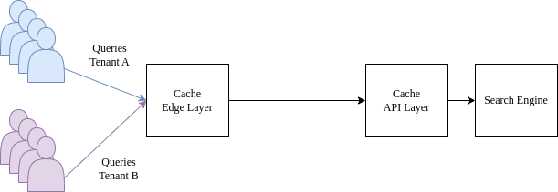
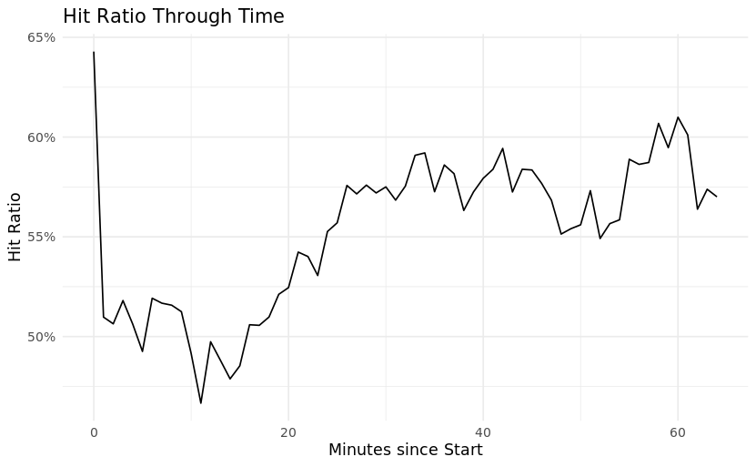
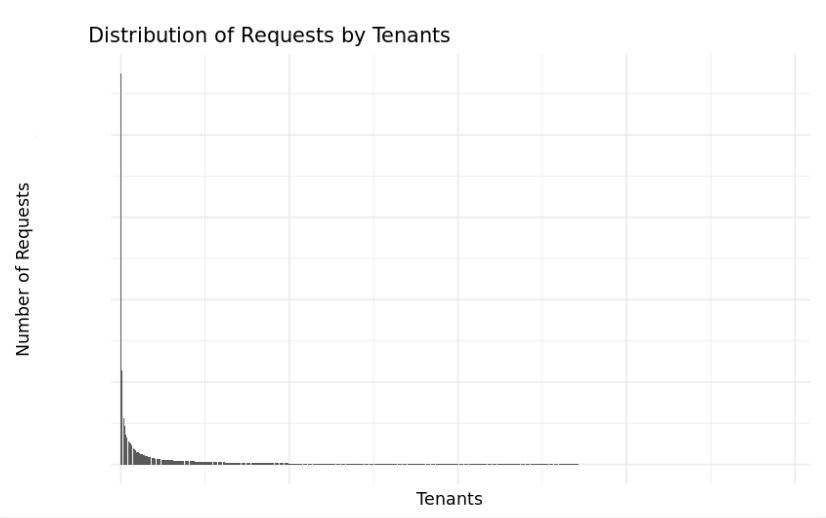
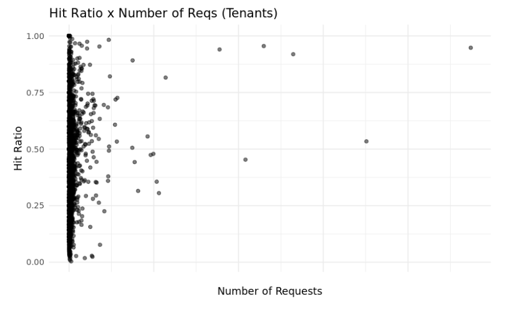

{width="1.2in"
height="1.1215277777777777in"}

**UNIVERSIDADE FEDERAL DE CAMPINA GRANDE**

**CENTRO DE ENGENHARIA ELÉTRICA E INFORMÁTICA**

**CURSO DE BACHARELADO EM CIÊNCIA DA COMPUTAÇÃO**

**THÚLIO ÍCARO CASTRO CARVALHO**

**[Avaliação de Uso de Cache em Catálogos de Ecommerce em Plataformas
Multitenants]{.smallcaps}**

**CAMPINA GRANDE - PB**

**2023**

**THÚLIO ÍCARO CASTRO CARVALHO**

**[Avaliação de Uso de Cache em Catálogos de Ecommerce em Plataformas
Multitenants]{.smallcaps}**

> **Trabalho de Conclusão Curso apresentado ao Curso Bacharelado em
> Ciência da Computação do Centro de Engenharia Elétrica e Informática
> da Universidade Federal de Campina Grande, como requisito parcial para
> obtenção do título de Bacharel em Ciência da Computação.**

**Orientador : Thiago Emmanuel Pereira**

**CAMPINA GRANDE - PB**

**2023**

**THÚLIO ÍCARO CASTRO CARVALHO**

**Avaliação de Uso de Cache em Catálogos de Ecommerce em Plataformas
Multitenants**

> **Trabalho de Conclusão Curso apresentado ao Curso Bacharelado em
> Ciência da Computação do Centro de Engenharia Elétrica e Informática
> da Universidade Federal de Campina Grande, como requisito parcial para
> obtenção do título de Bacharel em Ciência da Computação.**

**BANCA EXAMINADORA:**

**Thiago Emmanuel Pereira\
Orientador -- UASC/CEEI/UFCG**

**Roberto Medeiros de Faria\
Examinador -- UASC/CEEI/UFCG**

**Francisco Vilar Brasileiro\
Professor da Disciplina TCC -- UASC/CEEI/UFCG**

**Trabalho aprovado em: 03 de JULHO de 2023.\
**

**CAMPINA GRANDE - PB**

**RESUMO**

Um requisito comum para plataformas de comércio eletrônico é o
gerenciamento de catálogos de produtos. Em catálogos grandes e
*multitenants*, o gerenciamento de latências é um desafio, e o
armazenamento em cache geralmente é empregado para melhorar o
desempenho. Ao observar uma solução de catálogo de uma grande empresa de
comércio eletrônico, identificamos o que os engenheiros consideravam um
sistema de cache com qualidade abaixo do ideal. Com base em experiências
anteriores, os engenheiros da empresa acreditam que as características
da carga de trabalho afetam o desempenho do cache. Este trabalho visa
verificar essa hipótese. Usamos *traces* coletados de requisições de
produção para analisar e entender as características da carga de
trabalho, bem como relacioná-las com o comportamento do cache.

**Evaluation of Cache Usage on Ecommerce Catalogs of Multitenant
Platforms**

**ABSTRACT**

A common requirement for ecommerce platforms is the management of
product catalogs. On large, multitenant, catalogs, the managing
latencies is a challenge, and caching is usually employed to enhance
performance. By observing a catalog solution of a large ecommerce
company, we identified what engineers thought was a sub-optimal cache
system. Based on previous experience, the engineers of the company
believe that the characteristics of the workload impact cache
performance. This work aims to verify this belief. We use traces
collected from production incoming requests to analyze and understand
the workload characteristics, as well as relate them with the cache
behavior.

**Evaluation of Cache Usage on Ecommerce Catalogs of Multitenant
Platforms**

Thúlio Ícaro Castro Carvalho

thulio.carvalho\@ccc.ufcg.edu.br Universidade Federal de Campina Grande
(UFCG) Campina Grande, Paraíba, BR

Thiago Emmanuel Pereira

temmanuel\@computacao.ufcg.edu.br Universidade Federal de Campina Grande
(UFCG) Campina Grande, Paraíba, BR

Daniel Fireman

daniel.fireman\@ifal.edu.br\
Instituto Federal de Alagoas\
Maceió - AL, BR

**ABSTRACT**

A common requirement for ecommerce platforms is the management of
product catalogs. On large, multitenant, catalogs, the managing
latencies is a challenge, and caching is usually employed to enhance
performance. By observing a catalog solution of a large ecommerce
company, we identified what engineers thought was a sub-optimal cache
system. Based on previous experience, the engineers of the company
believe that the characteristics of the workload impact cache
performance. This work aims to verify this belief. We use traces
collected from production incoming requests to analyze and understand
the workload characteristics, as well as relate them with the cache
behavior.

**Keywords**

ecommerce, cache, multitenancy

**INTRODUCTION**
================

Ecommerce refers to the trading of goods and services on the internet.
It has been growing alongside the growth of the internet and its
userbase. According to the Annual Retail Trade Survey, in 2020,
ecommerce sales in the US increased by 43% \[3\]. One of the most
important metrics for ecommerces is sales conversion rate - nearly 40%
of ecommerce marketers polled by Databox cited conversion rate as the
most important ecommerce key performance indicator \[1,2\]. Website
performance has a large, measurable effect on conversion rates. Studies
have consistently shown that fast page speed will result in a better
conversion rate \[4\]. Given the current context, many ecommerce
companies are raising awareness about the efficiency of their online
systems, and good usage of web caching techniques can help them achieve
better performance by reducing access latencies \[5\].

Caching web content helps improve upon the responsiveness of websites by
reducing the load on backend resources and network congestion \[6\]. A
cache system sits between a client and an application and keeps copies
of the content maintained by the application. If a client requests
content that the cache has stored, it returns the content directly,
without contacting the origin server. When content is retrieved directly
from the cache system, one has a cache hit, otherwise when content is
not cached and needs to be recovered to the application, one has a cache
miss. Increases in the hit ratio can significantly impact a system's
performance. For instance, increasing the cache hit by just 1% from 98%
to 99% halves the number of requests going to the application.

Many alternatives exist to help optimize cache performance, such as
scaling the cache cluster \[7,8\], tuning the cache internals such as
the eviction policy \[8,9\], among others. Nevertheless, characterizing
and understanding the application's workload allows studying of traffic
patterns and cache access patterns \[8\], which ultimately allows
engineers to take well-based decisions on how to optimize their cache
solutions. Apart from that, the context of large ecommerce companies
presentes challenges for engineers designing caching solutions - the
products catalog, a key aspect of an ecommerce website, might be built
using a multitenant architecture (i.e. multiple independent stores with
different traffic patterns operate on the same shared environment).

Designing efficient caches in an multitenant environment is a challenge
for caching systems. Some of the well-known challenges are lack of
performance isolation, lack of customization and waste of system
resources \[10\], and they are specially challenging for ecommerce
companies, since an inefficient cache design might ultimately hinder the
latency perceived by users \[5\], degrading conversion rates \[4\].

Benchmarks such as \[11\] and \[12\] offer great resources and insights
about the characteristics of ecommerce workloads and their performance
impacts. However, no work has yet been done regarding the
characterization and analysis of cache workloads in multitenant catalog
applications for ecommerce.

To help fill this gap, in this work, we focus on characterizing the
workload of a large product catalog that handles billions of requests
every day of our ecommerce partner company. In order to understand the
workload characteristics, we collect traces of a passively instrumented
cache cluster that lies in front of a search engine for product index
catalogs. We learn relevant characteristics of this system such as
concentration of requests in tenants and help outline the general
behavior of the caching architecture.

RELATED WORK
============

Computing systems heavily rely on caching systems for optimizing. The
way that some applications rely on cache is so significant that a
downtime on caching systems can partially or completely shutdown an
application's ability of providing for users.

The most important metric about cache is the hit ratio. It represents
the ratio of hits among all incoming requests on the system. A hit means
that the cache returned the response for an user's request without
sending the request to the underlying application.

The focus of cache optimization resides in improving cache's hit ratio.
Understanding the nature of the underlying application and the behavior
of the userbase are primordial in order to optimize hit ratios.
Different types of problems express different patterns of recurring
requests that can have its responses stored for quick delivery to users.
Therefore, in order to characterize a cache system, it's crucial to
understand the workload that it is subjected to.

Techniques like tracing requests are used to gather request workloads,
which can then be used as object of analysis, which can provide several
insights about how the problem that the application and cache system
tries to work over work \[14, 11, 12\].

Given the workload / trace of a certain cache system, one can then
statistical tools in order to get a better view on the inner workings of
a cache system. Exploratory analysis, predictive analysis and modeling
are examples of approaches that can help us to gather those information
pieces \[14\].

Works such as \[11\] and \[12\] have identified characteristics of
typical ecommerce workloads and defined methodologies to benchmark such
systems. However, no work has been done in the characterization of
workloads given multitenant business models.

CONTEXT
=======

Our partner company focuses on providing software solutions that target
ecommerce problems. An ecommerce company such as our partner needs to
store thousands of products for your clients. Therefore, having a
reliable product catalog is paramount for customer satisfaction.

In our use-case, a product catalog is a service that allows it's users
(i.e. stores) to create, remove, update and delete products. It should
also allow (and be fast in doing so) the stores' users to retrieve
information about products. Additional features such as ranked
retrieval, spell checking queries, etc. are also important to deliver
quality informations and products to the users.

{width="3.3333333333333335in"
height="1.1527777777777777in"}

When a user makes a query to the product catalog, it will first hit the
edge cache systems. If the request misses on the edge layer, it will
ultimately be forwarded to the cache level that lies before the
catalog's search API. At this level, a request might or might not be
forwarded to the underlying backend. In this work, we focus on
characterizing the workload that arrives on the API Cache (closest to
the underlying search backend).

METHODOLOGY
===========

The methodology for characterizing the workload in this work must
includes two steps: 1 - Workload Collection, 2 - Analysis.

In order to collect the workload we need to understand what type of
information we want and where we can find the information we want.

It's of utmost importance gathering a series of informations about
requests that happened in a time-frame. We need to know what was the
cache response for each request, the timestamp it arrived at the cache
system and the tenant issued by the request. One approach to get this
information is to create a process that acts as a proxy between the user
and the requested host, and logs incoming requests and responses. This
approach is very time consuming and has the risk of slowing down
incoming requests.

Fortunatel, some caching servers such as NGINX \[13\] allows us to
instrument in order to track whether or not requests ended up being hit
or a miss on the cache. That's the approach we decided to use.

In order to get which tenant is issued in the request, we first need to
understand how tenants are represented in the search engine. For this
company use-case, each tenant is identified by an unique ID that is
usually added to any queries on the catalogs, via search parameters.

When a company that deals with millions of requests per minute chooses
to store logs for incoming requests in a database, the amount of storage
these logs are going to take is a huge concern. In our partner company,
engineers decided to only store a sample of the logs for incoming
requests. For our case, this means that only a fraction of all requests
have its logs persisted on a database.

In our work, we decided to use the database's API to get logs for
requests in a timeframe. We wrote a script that would make several
requests to the API in order to get all the logs in a specified
time-frame. There was a need to make multiple requests because getting
all the logs in a large time-frame could transmit a large amount of data
at once, and we didn't want to stress the system while collecting logs.

RESULTS
=======

We collected a trace in the interval of 4th of May, 2022, 08:56 am to
09:43 am. It represented a fraction of all the requests that arrived at
the cache during the time frame. Some relevant characteristics are
further discussed in this section.

What metrics should we look at?
-------------------------------

When exploring the trace, one of the most important things is to
understand which metrics to look at to get a better understanding of how
the system behaves. Since hit rate is important for caching services,
this is the metric we'll look at the most. Apart from the hit rate, we
also know that multitenancy is an important and challenging
characteristic of our system. For this reason, we'll try to understand
more about how the tenants are distributed and what are the implications
of this distribution.

Hit Ratio
---------

When using Time To Live (TTL) as an eviction policy in an NGINX cache,
there's the option of providing stale data to requests that arrived
shortly after a time threshold. When using the staleness feature, a
request that arrives on the cache requesting a stale item will
immediately return, to the user, the cached stale data. After that, the
cache will update the staled cache item by sending an asynchronous
request to the underlying backend.

With the staleness feature, understanding Hit Rate gets a bit more
complicated. From the perspective of the underlying backend, there is no
difference between a Miss or a Stale request. However, for the end user,
there is no difference between a Hit or a Stale request - apart from
having stale data. This means that each perspective can adopt different
views of the hit rate. The end user will interact with the system as if
it's hit rate is the sum of hits and stale occurrences, while the
backend will interact with the cache as if it's hit rate is just the
amount of actual hits - not considering staled responses. We chose to
focus on this analysis considering the hit ratio from the backend
perspective.

In our cache trace, the amount of each type of cache response is
described below.

  Response Type   Ratio (%)
  --------------- -----------
  HIT             55
  MISS            14
  STALE           30
  UPDATING        \< 1

The 55% hit ratio, however, isn't stable over time. In the time-frame of
our analysis, the standard deviation was around 7% of the mean. This
behavior can be seen below.

{width="3.3333333333333335in"
height="2.0555555555555554in"}

Multitenancy
------------

Apart from understanding the Hit Rate behavior, it is important to
analyze the behavior of multitenancy and understand its possible impacts
in the cache. In order to get insights on this aspect, we chose to
analyze how some metrics relate to the tenants.

At first, we learn how the requests are distributed between tenants -
this shows us the popularity of the tenants.

{width="3.3333333333333335in"
height="2.0972222222222223in"}

This plot shows us the distribution of requests by tenants. We can see
that some tenants are very popular while most are responsible for few
requests. In summary, there's a high concentration of requests in few
tenants - and we can verify how many tenants are responsible for how
many requests, as seen with some examples in the next table.

  \% of tenants   \% of total requests
  --------------- ----------------------
  1%              39%
  10%             76%

We can't, however, correlate this high concentration with the hit ratio
of the tenants, as seen below (correlation coefficient of 0.09).

{width="3.3333333333333335in"
height="2.013888888888889in"}

CONCLUSION
==========

We now understand how a typical ecommerce product catalog cache behaves.
Some key takeaways are:

High concentration of requests in tenants
-----------------------------------------

In summary, few tenants are responsible for most requests. This means,
in practice, that there are few stores (i.e. tenants, in our context)
that are more famous than others - and they account for most traffic. A
good statistic that illustrates this is that the top 10% most popular
tenants are responsible for 76% for all requests. A high concentration
like this might mean for some caching systems that there is room for
improvement with a tenant-aware approach. For our partner company case,
there isn't correlation between popularity of tenants and the hit ratio
of tenants.

Summary of cache behavior aspects
---------------------------------

  Relevant Numbers                  
  --------------------------------- -----
  Hit Ratio                         55%
  Hit Ratio Variation Coefficient   7%
  Stale Ratio                       30%

We analyzed the requests distribution over time and learned that hit
ratio varies with a standard deviation of 7% of the mean.

Threats to validity
-------------------

In our work, we analyzed only a sample of the real workload that arrives
at the caching system. We understand that this limitation of our data
limits the range of analysis we can execute. Further work can be done in
order to understand whether or not using the full dataset would change
any of the insights.

**REFERENCES**
==============

1.  15 Critical Ecommerce Metrics You Must Track in 2022. Available in:
    [[https://www.shopify.com/blog/basic-ecommerce-metrics]{.underline}](https://www.shopify.com/blog/basic-ecommerce-metrics)

2.  The Most Important Ecommerce KPIs for Tracking & Growing Sales.
    Available in:
    [[https://databox.com/ecommerce-kpis]{.underline}](https://databox.com/ecommerce-kpis)

3.  Annual Retail Trade Survey Shows Impact of Online Shopping on Retail
    Sales During COVID-19 Pandemic. Available in:
    [[https://www.census.gov/library/stories/2022/04/ecommerce-sales-surged-during-pandemic.html]{.underline}](https://www.census.gov/library/stories/2022/04/ecommerce-sales-surged-during-pandemic.html)

4.  How website performance affects conversion rates. Available in:
    [[https://www.cloudflare.com/learning/performance/more/website-performance-conversion-rates/]{.underline}](https://www.cloudflare.com/learning/performance/more/website-performance-conversion-rates/)

5.  Aggarwa, Wolf, Yu. Caching on the World Wide Web

6.  Web Caching. Available in:
    [[https://aws.amazon.com/caching/web-caching/]{.underline}](https://aws.amazon.com/caching/web-caching/)

7.  Nishtala R. et al. Scaling Memcache at Facebook

8.  Huang Q. et al. An Analysis of Facebook Photo Caching

9.  Beckmann, Chen, Cidon. LHD: Improving Cache Hit Rate by Maximizing
    Hit Density

10. Stefanovici et al. Software-Defined Caching: Managing Caches in
    Multi-Tenant Data Centers

11. Hariharan R., Sun N., Workload Characterization of SPECweb2005

12. Wayne D. Smith. TPC-W\*: Benchmarking An Ecommerce Solution

13. NGINX. Available in:
    [[https://www.nginx.com/]{.underline}](https://www.nginx.com/)

14. Dror G. Feitelson, Workload Modeling for Computer Systems
    Performance Evaluation
